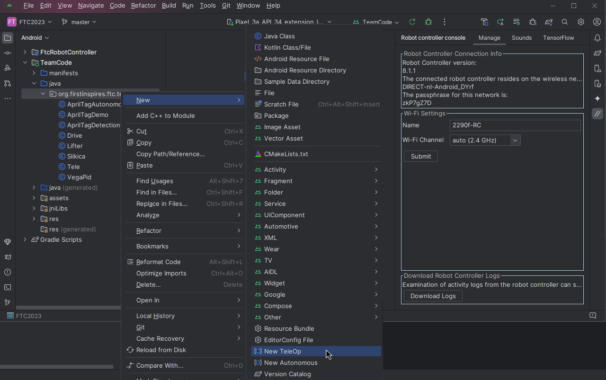
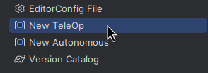
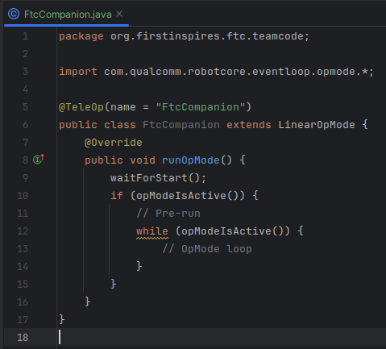
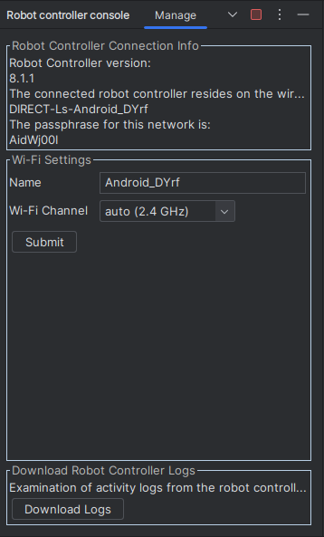
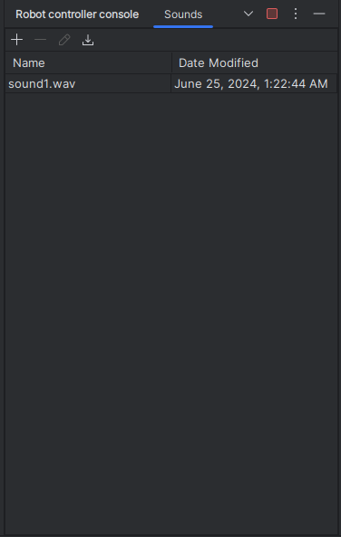

  

<h3 align="center">An FTC companion plugin for the Android Studio </h3>
 

[![Contributors][contributors-shield]][contributors-url]
[![Forks][forks-shield]][forks-url]
[![Stargazers][stars-shield]][stars-url]
[![Issues][issues-shield]][issues-url]
[![MIT License][license-shield]][license-url]

## 📄 Docs
Refer to the [Wiki Section][wiki-url].

## 📦 Download

## 🎨 Features
The FTC companion plugin for Android Studio makes it easier for FTC teams to develop their robots. It includes snippet
generator, and Robot controller console all within the Android Studio environment.

### Code snippets generators
FTC Companion includes code snippets generators that make generating OpMode boilerplate code easy. It supports TeleOp
as well as Autonomous boilerplate generation.

### Robot controller console
Built in robot console allow for managing settings you would otherwise have to on the robot's web interface. It includes
Wi-Fi management, sounds manager, TensorFlow model manager and so on.

    
    

## 📜 License
This software is licensed under the [GPL-3.0 license][license-url]

###### Made with ❤️ by [VegaMind #22903](https://github.com/vegamind)

[contributors-shield]: https://img.shields.io/github/contributors/vegamind/ftccompanion.svg?style=for-the-badge
[forks-shield]: https://img.shields.io/github/forks/vegamind/ftccompanion.svg?style=for-the-badge
[stars-shield]: https://img.shields.io/github/stars/vegamind/ftccompanion.svg?style=for-the-badge
[issues-shield]: https://img.shields.io/github/issues/vegamind/ftccompanion.svg?style=for-the-badge
[license-shield]: https://img.shields.io/github/license/vegamind/ftccompanion.svg?style=for-the-badge

[contributors-url]: https://github.com/vegamind/ftccompanion/graphs/contributors
[forks-url]: https://github.com/vegamind/ftccompanion/network/members
[stars-url]: https://github.com/vegamind/ftccompanion/stargazers
[issues-url]: https://github.com/vegamind/ftccompanion/issues
[license-url]: https://github.com/vegamind/ftccompanion/blob/master/LICENSE
[wiki-url]: https://github.com/vegamind/ftccompanion/wiki
[releases-url]: https://github.com/vegamind/ftccompanion/releases
[discussions-url]: https://github.com/vegamind/ftccompanion/discussions